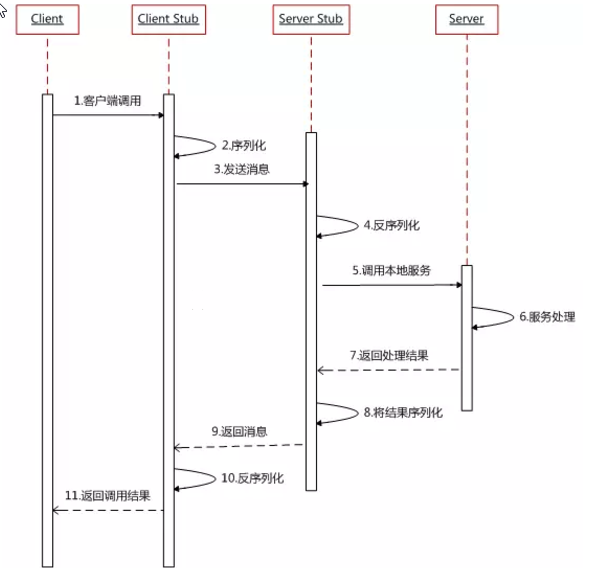

# MyNetty-RPC 

## Rpc介绍

Rpc的全程是Remote Procedure Control，即远程过程调用，比较直白的理解是，需要调用一个方法，但是当前机器并不能提供此项服务，因此只能找其他机器来提供服务，即调用远程机器的服务像调用本地服务一样。

## Rpc最简单实现

简单的调用链路如下，图来源于网络

可参考[马士兵老师Rpc实现](https://www.bilibili.com/video/BV17Z4y1s7cG?from=search&seid=9014784717763293574)，核心思路就是需要定义要实现类的接口

~~~java
public interface IUserService {
    public User findUserById(Integer id);
}
~~~

然后通过动态代理生成此接口的代理类，核心参数被被代理类的ClassLoader，接口列表及InvocationHandler h

~~~java
Proxy.newProxyInstance(IUserService.class.getClassLoader(), new Class[] {IUserService.class}, h);
~~~

可以简单理解为，调用生成的动态代理类中的方法时，实际调用的是InvocationHandler h中的invoke方法，在h中做的事情很简单

- 确定要传输参数
  - 调用接口名
  - 调用方法名
  - 参数类型（可能存在同名方法，有重载）
  - 参数列表
- 序列化待传输参数（从对象转换为字节数组，便于网络传输）
- 确定服务器地址（一对一情况）
- 网络传输（最简单为BIO）
- 反序列化服务端返回参数
- 返回结果

其中服务端要做的事为

- 监听客户端连接（Bio）
- 反序列化客户端传输参数
- 根据此参数，基于反射得到方法运行结果
- 序列化结果
- 网络传输

比较关键的是反射的过程，可以通过map保存className与调用类对象serviceBean的映射，然后获取被调用服务的Class对象，通过其方法名与参数类型获取Method对象，再调用方法对象的invoke方法，进行具体方法的调用

~~~
Object serviceBean = handlerMap.get(className);
Class<?> serviceClass = serviceBean.getClass();
// 获取调用服务的Class对象
method = serviceClass.getMethod(methodName, parameterTypes);
method.setAccessible(true);
return method.invoke(serviceBean, parameters);
~~~

这样便完成了一个最基本的rpc的功能

## 简单Rpc存在问题

上述Rpc框架存在很多问题，比如

- 网络传输：使用BIO传输，同步阻塞，性能效率低，可以采用NIO、AIO或Netty框架
- 序列化与反序列化：基于Java的API进行序列化与反序列操作，得到的数据量较大，不便于网络传输，而且不安全，可使用Kyro，Protostuff、Hession等
- 服务发现：上面客户端直接指定了服务端地址，但在分布式的环境下，可能有多台服务器提供服务，需要有分布式的注册中心与服务发现中心，可使用Zookeeper，Consul，Nacos等
- 负载均衡：在存在多态服务器的情况，为了让每台服务器锁接收的客户端请求尽可能的均衡，需要使用不同的负载均衡算法
- TCP黏包：TCP可能存在黏包的情况，为了解决此问题，需要在传输的消息之上，附加一层自定义消息体系，比如魔数（校验），选择序列化方式，消息传输长度等

